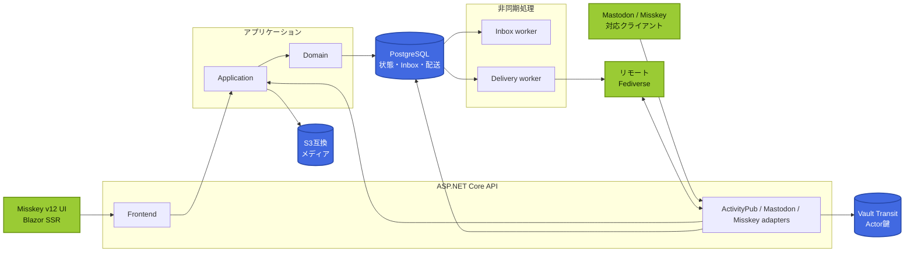

<p align="center">
  
</p>

<h1 align="center">mk-lite</h1>

<p align="center">
  PostgreSQLの耐久キューでActivityPubを運び、Misskey v12の画面をBlazorで提供する.NET製Fediverseサーバー
</p>

<p align="center">
  <a href="https://github.com/hgzt23678/mk-lite/actions/workflows/ci.yml"></a>
  
  
  
  <a href="LICENSE"></a>
  
</p>

<p align="center">
  <a href="#-mk-liteとは">概要</a>&nbsp; | &nbsp;
  <a href="#-ローカルへインストール">インストール</a>&nbsp; | &nbsp;
  <a href="#-アーキテクチャ">構成</a>&nbsp; | &nbsp;
  <a href="#-現在の対応範囲">対応範囲</a>&nbsp; | &nbsp;
  <a href="#-開発とテスト">開発</a>&nbsp; | &nbsp;
  <a href="#-関連文書">文書</a>
</p>

> [!WARNING]
> mk-liteは活発に開発中です。
> Mastodon API、Misskey API、Misskey v12フロントエンドの完全互換や、本番導入の準備完了は宣言していません。
> 対応範囲はルートの存在ではなく、自動試験と実インスタンス試験の証拠に基づいて公開します。

## 🌱 mk-liteとは

mk-liteは、複数ユーザーと複数プロセスで動かせるActivityPubサーバーです。
Inboxの受付、Activityの副作用、配送先ごとの再試行を分離し、配送ジョブの正本をPostgreSQLへ保存します。

Web画面には、Misskey 12.119.2のDOM、CSS、画面遷移を参照してBlazorへ移植したフロントエンドを使います。
本番の実行経路はASP.NET Coreのstatic SSRとInteractive Server Blazorで構成し、Vueランタイムを読み込みません。

<table>
  <tr>
    <td width="33%" align="center">
      <h3>🌐 耐久性のある連合</h3>
      <p>Inboxの重複排除、配送リース、指数バックオフ、Dead LetterをPostgreSQLへ記録します。</p>
    </td>
    <td width="33%" align="center">
      <h3>🎨 Misskey v12 UI</h3>
      <p>対応機能では元のDOM、CSS class、テーマ、モーション、レスポンシブ挙動をBlazorへ移植します。</p>
    </td>
    <td width="33%" align="center">
      <h3>🛡️ 運用を考えた境界</h3>
      <p>HTTP署名、SSRF防御、Vault鍵管理、S3メディア、監査、OpenTelemetryを独立した責務に分けます。</p>
    </td>
  </tr>
</table>

### 主な機能

- Actor、Object、Inbox、Outbox、Collectionを含むActivityPub Server-to-Server機能
- Create、Update、Delete、Follow、Accept、Reject、Like、Announce、Undo、Blockの受信と送信
- Public、Unlisted、Followers-only、Mentioned-onlyの可視性と署名付きprivate dereference
- Cavage HTTP SignaturesとRFC 9421の受信検証、Actorごとの鍵管理
- S3互換ストレージ、ClamAV、ffmpegを使うメディア検査と変換
- ローカルアカウント、セッションCookie、MiAuth、権限付きアプリトークン
- APIとWorkerの独立スケール、readiness、OpenTelemetry、配送停止、監査

実装と試験の対応関係は[仕様適合表](docs/CONFORMANCE.md)で確認できます。

## 🚀 ローカルへインストール

Docker Composeを使うと、PostgreSQL、MinIO、ClamAV、Vault、API、Worker、Caddy、OpenTelemetry Collectorを一つのローカル環境へ起動できます。
この構成は開発と動作確認用です。

### 必要なソフトウェア

| ソフトウェア | バージョンまたは用途 |
| --- | --- |
| Git | リポジトリの取得 |
| Docker Engine | Linuxコンテナの実行 |
| Docker Compose | 2.24.4以降 |
| OpenSSL | ローカルSecretの生成 |
| .NET SDK | ソースから検証する場合は10.0.302 |
| Node.js | Vue比較元とinventoryを検証する場合は22.23.1 |

SDKの固定値は[`global.json`](global.json)と[CI workflow](.github/workflows/ci.yml)を正本とします。

### 1. リポジトリを取得する

```bash
git clone https://github.com/hgzt23678/mk-lite.git
cd mk-lite
cp .env.example .env
```

### 2. ローカルSecretを用意する

`.env`内の`replace-with-...`は、そのままでは起動に使えません。
PostgreSQL、MinIO、Vaultには別々のランダム値を設定してください。

Vault token fileはリポジトリの外へ作成します。

```bash
mk_lite_secret_dir="${XDG_CONFIG_HOME:-$HOME/.config}/mk-lite"
install -d -m 0700 "$mk_lite_secret_dir"
openssl rand -hex 32 > "$mk_lite_secret_dir/vault-token"
chmod 0400 "$mk_lite_secret_dir/vault-token"
```

`.env`では次の値を変更します。

| 設定 | 内容 |
| --- | --- |
| `AP_POSTGRES_PASSWORD` | PostgreSQL専用のランダム値 |
| `AP_MINIO_ROOT_USER` | MinIO専用のランダムなaccess key |
| `AP_MINIO_ROOT_PASSWORD` | MinIO専用のランダムなsecret key |
| `AP_VAULT_TOKEN` | `vault-token`ファイルと同じローカル専用値 |
| `AP_VAULT_TOKEN_FILE` | `vault-token`ファイルの絶対パス |

追加のランダム値は`openssl rand -hex 32`で生成できます。
`AP_OIDC_*`は後述するローカル連合環境で使います。
`.env`、token file、証明書、秘密鍵はコミットしないでください。

### 3. 起動する

```bash
docker compose config --quiet
docker compose up --build --detach --wait --wait-timeout 300
```

Migrationは専用の`migrate`サービスが先に適用し、成功後にAPIとWorkerが起動します。
状態はコンテナ内部のreadiness endpointで確認できます。

```bash
docker compose ps
docker compose exec api curl --fail --silent http://localhost:8080/health/ready
```

ブラウザーでは`https://localhost:8443/app/`を開きます。
Caddyはローカル用の内部CAを使うため、ホストがそのCAを信頼していない場合は証明書の警告が表示されます。
開発環境の確認を目的に、製品側のHTTPS検証を無効化しないでください。

### 4. ローカルActorを作成する

Actorは明示的に作成します。

```bash
docker compose run --rm api create-local-actor alice "Alice"
```

既定のCompose構成は自己登録を無効にしています。
このコマンドはActivityPub Actorを作成しますが、ブラウザーログイン用パスワードを固定値で生成しません。
登録とログインを含むDevelopment試験には、次のローカル連合環境を使ってください。

### 5. 停止する

```bash
docker compose down
```

PostgreSQLとメディアのデータはnamed volumeへ残ります。
`docker compose down --volumes`は全ローカルデータを削除するため、試験データを破棄するときだけ実行してください。

## 🐄 ローカル連合環境

`fediverse-pasture`を使うと、Mastodon、Misskey、Pleroma、mk-liteを外部Fediverseから隔離したネットワークへ起動できます。
実インスタンス間のFollow、投稿、reaction、署名、再送を確認するための環境です。

`.env`の`AP_OIDC_ADMIN_PASSWORD`、`AP_OIDC_ALICE_PASSWORD`、`AP_OIDC_REALM_FILE`も安全なローカル値へ変更してから起動します。
realm fileにはリポジトリ外の絶対パスを指定してください。

```bash
bash eng/pasture.sh fetch
bash eng/pasture.sh config
bash eng/pasture.sh up
bash eng/pasture.sh create-actor alice "Alice"
```

| 実装 | ローカルURL |
| --- | --- |
| Mastodon | `http://localhost:2970` |
| mk-lite | `http://localhost:2971` |
| Pleroma | `http://localhost:2972` |
| Misskey | `http://localhost:2973` |

```bash
bash eng/pasture.sh status
bash eng/pasture.sh down
```

固定バージョン、隔離ネットワーク、試験手順は[ローカル連合開発](docs/LOCAL_FEDERATION.md)に記録しています。

## 🧭 アーキテクチャ

HTTP契約とDomainを直接結び付けず、Mastodon API、Misskey API、ActivityPubを別々のadapterとして扱います。
ローカル状態変更、Activity生成、配送ジョブ生成は同じPostgreSQL transactionで確定します。



APIとWorkerは同じbinaryを使いながら、役割ごとに独立して増減できます。
モジュールの依存方向は[フロントエンドアーキテクチャ](docs/frontend-blazor/ARCHITECTURE.md)と[ADR一覧](docs/adr/README.md)に記録しています。

## 🧩 現在の対応範囲

フロントエンドの見た目はMisskey 12.119.2、バックエンドの機能境界は`mei23/dolphin`を参照しています。
比較用Vueコードはinventory生成と差分確認にだけ使い、本番イメージには含めません。

| 領域 | 状況 | 公開している範囲 |
| --- | --- | --- |
| ActivityPub Server-to-Server | 🟢 主要経路を実装 | 主要Activity、署名、Inbox、Outbox、配送再試行 |
| Misskey v12 Blazor UI | 🟡 対応機能を移植 | Dolphin側に実契約がある画面と共通UI |
| Mastodon REST API 4.6.2 | 🟡 限定対応 | inventory 331経路中23経路 |
| Misskey API 12.119.2 | 🟡 限定対応 | inventory 321 endpoint中23 endpoint |
| Drive管理、Chart、Gallery、Antenna、Clip、Channel | ⚪ 対象外 | バックエンド契約がない機能は見せかけのUIを作らない |

生成したport mapでは、Misskey v12由来の535 sourceを329件の実装mappingと206件の明示的なscope exclusionへ分類しています。
`implemented`は対応するRazor実装と自動試験があることを示し、「Misskey v12の全機能と互換」を意味しません。

最新状態は[フロントエンド残タスク](docs/frontend-blazor/REMAINING_TASKS.md)、[Mastodon API inventory](docs/compatibility/MASTODON_4_6_2.md)、[Misskey API inventory](docs/compatibility/MISSKEY_12_119_2.md)で確認できます。

## 🧪 開発とテスト

.NETコードは次の品質ゲートで検証します。

```bash
dotnet tool restore
dotnet restore ActivityPubServer.slnx --locked-mode
dotnet format ActivityPubServer.slnx --verify-no-changes --no-restore
dotnet build ActivityPubServer.slnx --configuration Release --no-restore
dotnet test ActivityPubServer.slnx --configuration Release --no-build
```

Misskey v12比較元と生成inventoryは次のコマンドで検証します。

```bash
npm --prefix frontend/misskey-v12 ci --ignore-scripts
npm --prefix frontend/misskey-v12 run typecheck
npm --prefix frontend/misskey-v12 test
npm --prefix frontend/misskey-v12 run inventory:check
npm --prefix frontend/misskey-v12 run verify:upstream
```

CIはRelease build、自動試験、Chromium回帰試験、migration script生成、依存関係監査、ライセンス検査、コンテナスキャン、SBOM生成を実行します。
2026年8月13日の検証記録では.NET試験913件が成功し、失敗とskipはありません。
再現条件と未検証項目は[検証記録](docs/VERIFICATION.md)を参照してください。

## 🏗️ 本番導入

本番環境では、開発用Composeや`deploy/pasture`をそのまま使いません。
次の境界を環境ごとに設定してから、専用jobでmigrationを適用します。

- 不変の`Federation__PublicBaseUri`とHTTPS終端
- `SSL Mode=VerifyFull`を使うPostgreSQL接続
- HTTPSとserver-side encryptionを有効にしたS3互換ストレージ
- Vault、Data Protection証明書、OAuth証明書を保存するSecret Store
- 固定したtrusted proxyと外向き通信のnetwork policy
- APIとWorkerのreadiness、resource limit、OpenTelemetry export
- PostgreSQL、オブジェクト、Actor鍵、Data Protection keyのバックアップ

DB migrationはWeb起動から分離します。

```bash
dotnet run --project src/ActivityPub.Api -- migrate
```

導入前に[デプロイ手順](docs/DEPLOYMENT.md)、[本番設定例](deploy/appsettings.Production.example.json)、[本番運用チェックリスト](docs/PRODUCTION_CHECKLIST.md)を確認してください。

## 📚 関連文書

| 文書 | 内容 |
| --- | --- |
| [仕様適合表](docs/CONFORMANCE.md) | ActivityPub、互換API、相互運用の実測範囲 |
| [検証記録](docs/VERIFICATION.md) | build、試験、障害注入、未検証項目 |
| [脅威モデル](docs/THREAT_MODEL.md) | 信頼境界、攻撃者、保護対象 |
| [データモデル](docs/DATA_MODEL.md) | Actor、Activity、Object、配送、モデレーション |
| [配送状態遷移](docs/DELIVERY_STATE_MACHINE.md) | lease、retry、Dead Letter、再処理 |
| [依存関係](docs/DEPENDENCIES.md) | ライセンス、更新状況、置換可能性 |
| [運用Runbook](docs/runbooks/README.md) | バックアップ、復旧、障害、鍵漏洩への対応 |
| [ADR一覧](docs/adr/README.md) | アーキテクチャ上の決定と理由 |

## ⚖️ ライセンスと上流コード

特記がないコードは、[`LICENSE`](LICENSE)に基づくGNU Affero General Public License version 3 onlyで提供します。

Misskey v12の比較元は、`misskey-dev/misskey`のtag `12.119.2`、commit `a5a74f4434b179cdb1f97af98bf294c8b18de0e2`へ固定しています。
該当するフロントエンドコードには[`LICENSE`](frontend/misskey-v12/LICENSE)と[`NOTICE.md`](frontend/misskey-v12/NOTICE.md)を同梱しています。
帰属と変更範囲はルートの[`NOTICE.md`](NOTICE.md)および各frontendディレクトリのNOTICEに記載しています。
第三者ライブラリと同梱アセットには、それぞれのライセンスが適用されます。
